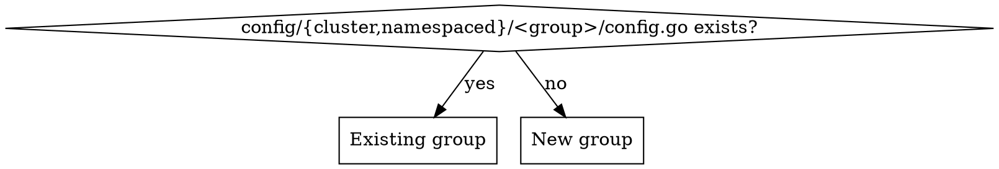

# Add a Nebius Resource

## Overview

provider-upjet-nebius is an Upjet provider wrapping the **Terraform plugin-framework** provider `nebius/nebius`. Adding a resource is config-only: declare it, run codegen, curate examples. Every resource is generated **twice** — cluster-scoped (`<group>.nebius.upbound.io`) and namespaced (`<group>.nebius.m.upbound.io`).

**Core principle:** the resource's behavior is decided by three answers you must look up, never guess — its **NID type prefix** (from the Nebius Go SDK), what its **`parent_id`** represents (from provider-metadata.yaml), and which fields are **references to other in-provider resources**.

## When to use
- Adding one or more `nebius_*` Terraform resources to provider-upjet-nebius.
- Extending an existing group (e.g. another `vpcv1` resource) or introducing a new group.

## When NOT to use
- Reviewing/auditing a provider → use `reviewing-upjet-providers`.
- Changing auth/ProviderConfig, controllers by hand, or non-Nebius providers.

## Architecture pointers
Repo `CLAUDE.md` has the full map. The files you touch:
- `config/external_name.go` — `ExternalNameConfigs` map. **Also gates generation**: a resource absent here is never generated (it feeds `WithTerraformPluginFrameworkIncludeList`).
- `config/groups.go` — `GroupMap`: TF name → (group, Kind).
- `config/{cluster,namespaced}/<group>/config.go` — per-group `AddResourceConfigurator`; references live here. **Keep the two copies identical.**
- `config/{cluster,namespaced}/provider.go` — registers each group's `Configure`.

## Workflow

Track each step as a todo.

**1. Read the schema + metadata for the resource.** It tells you everything below.
```bash
python3 - <<'PY'
import json; r=json.load(open('config/schema.json'))['provider_schemas']['registry.terraform.io/nebius/nebius']['resource_schemas']['<TF_NAME>']['block']
print(json.dumps(r, indent=1)[:4000])
PY
grep -n "<TF_NAME>:" -A40 config/provider-metadata.yaml   # examples + 'metadata.parent_id:' semantics
```

**2. `config/external_name.go`** — add:
```go
"<TF_NAME>": config.FrameworkResourceWithComputedIdentifier("id", "<TYPE>-e0t000000000000000"),
```
`<TYPE>` is the **NID type prefix**, found in the Go SDK proto descriptors — do not invent it:
```bash
grep -rhoE "<servicename>[a-z]+" $(go env GOMODCACHE)/github.com/nebius/gosdk@*/ | sort | uniq -c | sort -rn | head
# confirm the exact token sits on the id field:  grep -rn '<candidate>R\x02id' <gosdk>
```
e.g. `vpcnetwork`, `vpcsecurityrule`, `storagebucket`, `computeinstance`. `e0t` is the default SDK routing code and the 15 zeros are a dummy weakID — copy that part verbatim; only `<TYPE>` changes per resource. (Placeholder is used only for the initial framework read; it must be a syntactically valid NID.)

**3. `config/groups.go`** — add `"<TF_NAME>": ReplaceGroupWords("<group>", <n>)`. The group is service+version concatenated and `<n>` is the number of leading words to drop to reach the Kind: `nebius_vpc_v1_route_table` → `ReplaceGroupWords("vpcv1", 2)` → group `vpcv1`, Kind `RouteTable`. `<n>` = words in `<service>_<version>` (usually 2).

**4. References (only if the resource references other *in-provider* resources).** See decision below. Add to **both** `config/cluster/<group>/config.go` and `config/namespaced/<group>/config.go`:
```go
p.AddResourceConfigurator("<TF_NAME>", func(r *config.Resource) {
    r.References["<dotted_snake_case_tf_path>"] = config.Reference{
        TerraformName: "<target_TF_name>",
        Extractor:     `github.com/crossplane/upjet/v2/pkg/resource.ExtractParamPath("id",true)`,
    }
})
```
- Reference keys are **dotted snake_case TF attribute paths**. Nested single objects work: `ipv4_private.subnet_id`, `next_hop.allocation.id`. **Never use `[*]`** for list elements — Upjet silently drops it.
- A field is a reference only if its target is a resource THIS provider manages. `source_image_id`/`group_id` pointing at a type not in the provider → leave as a plain field, no reference.

**5. `make generate`** (~2–3 min; downloads terraform, pulls docs, regenerates). It rewrites `apis/`, `internal/controller/`, `package/crds/`, `examples-generated/`, and **`config/generated.lst` automatically — never hand-edit `generated.lst`.** Codegen also creates the whole API/controller package for a brand-new group on its own (no manual wiring). If it fails with `No rule to make target 'generate'`, the `build/` git submodule is uninitialized (common in fresh worktrees) — run `git submodule update --init --recursive` and retry; that's an environment issue, not a config error.

**6. `go build ./...`** to confirm. Expect a wide but benign diff (see Gotchas).

**7. Curate `examples/`** from `examples-generated/` — see Examples below.

## New group vs existing group


- **Existing group:** add your `AddResourceConfigurator` block to the existing `config.go` (both scopes). Nothing else.
- **New group, with references:** create `config/cluster/<group>/config.go` and `config/namespaced/<group>/config.go` (each `package <group>`, `func Configure(p *config.Provider)`), AND register them: add `ProviderConfiguration.AddConfig(<group>.Configure)` + the import in **both** `config/cluster/provider.go` and `config/namespaced/provider.go`.
- **No references at all (even for a brand-new group):** steps 2–3 are sufficient — do **not** create any `config.go` or touch `provider.go`. Codegen builds the new group's API/controller packages itself. (An empty `Configure` is clutter — skip it.)

## parent_id — look it up, don't assume

Most Nebius resources have a required `parent_id`. It is **not always the project**. Check the resource's own section in provider-metadata.yaml — scope it, the `metadata.parent_id:` doc lines are easy to misattribute to an adjacent resource (read only between this resource's `<TF_NAME>:` header and the next `nebius_*:` header). Two cases:
- "represents the Project / IAM Container", **or no `metadata.parent_id:` line at all and the example shows a literal `"parent_id": "project-id"`** → leave `parentId` as a literal; examples use `parentId: ${data.nebius_project_id}`. No reference.
- "represents the RouteTable / SecurityGroup / ..." (or the example shows `${nebius_..._x.id}`) → `parent_id` IS a reference; configure it like any other reference in step 4.

## Examples

For each new resource write `examples/{cluster,namespaced}/<group>/v1beta1/<kind>.yaml`, starting from `examples-generated/.../<kind>.yaml` and fixing what codegen can't know:
- Replace `parentId: project-id` → `parentId: ${data.nebius_project_id}` for project-parented resources (uptest injects it from the datasource ini given via `UPTEST_DATASOURCE_PATH` — see E2E section; the filename is user-chosen, not fixed). Tenant-parented resources (e.g. IAM federation / invitation / `iam_v2_project`) use `parentId: ${data.nebius_tenant_id}` instead. The injectable data sources are whatever that ini defines — typically `nebius_project_id`, `nebius_tenant_id`, `nebius_default_editor_group_id`.
- Make each file **self-contained**: append every dependency as extra `---` docs, all sharing `testing.upbound.io/example-name: default`; selectors resolve by Kind, so deps can share one label. (Generated examples point selectors at `example-name: example` with no matching dependency — add the real chain.)
- **Sensitive fields become `<field>SecretRef`, not a plain field.** Upjet maps any Terraform attribute marked `Sensitive` (e.g. `nebius_iam_v1_invitation.email`) to a `<field>SecretRef` that references a Kubernetes Secret key (`name` / `namespace` / `key`) — the plain field name is **absent** from the CRD, so an inline value fails schema validation. In the example, set `<field>SecretRef` and append the referenced `Secret` as another `---` doc (a raw `apiVersion: v1` / `kind: Secret`, `type: Opaque`, value under `stringData`); the Secret lives in `namespace: upbound-system` for **both** scopes. When a field you expected is missing from `forProvider`, list the `forProvider` `keys` on the generated CRD (yq's `has("x"), has("y")` comma form gives false negatives — dump `keys` instead) — sensitivity is the usual reason. Nested sensitive fields follow the same rule (e.g. `payload.stringValueSecretRef`, `source.accessKeyIdSecretRef`).
- **Forcing a field sensitive when Terraform didn't.** If a field carries sensitive material (a public key, certificate, token) but the TF schema leaves it un-flagged — so it generated as a plain inline field — mark it in the resource's configurator (step 4) and re-generate; it then becomes `<field>SecretRef`. Top-level: `r.TerraformResource.Schema["data"].Sensitive = true`. Nested: walk the schema, `r.TerraformResource.Schema["source"].Elem.(*schema.Resource).Schema["access_key"]...Sensitive = true` (import `github.com/hashicorp/terraform-plugin-sdk/v2/helper/schema`). Precedents: `config/cluster/iamv1/config.go` (auth_public_key/federation_certificate `data`), `config/cluster/storagev1/config.go` (transfer `access_key_id`). Then update the example to the SecretRef + `Secret` form above.
- **namespaced copy** = same content with `apiVersion: <group>.nebius.m.upbound.io/v1beta1` and `namespace: upbound-system` on every doc (the raw `v1` `Secret` deps are already in `upbound-system`, so they are identical across scopes).
- **No `examples:` block in provider-metadata.yaml → no generated example** (e.g. `nebius_vpc_v1_route`). Hand-build it from the CRD schema in `package/crds/`.
- Validate field names/enums against the generated CRD before finishing.

## E2E testing & debugging

`go build` proves it compiles; only `make e2e` proves the resource reconciles against real Nebius. Test one example at a time.

**Run one example.** The credentials and datasource locations are **not fixed** — ask the user where their cloud-credentials JSON and datasource ini live (this repo happens to use `uptest.json` / `uptest-data.ini`, but never assume that):
```bash
UPTEST_EXAMPLE_LIST="examples/<scope>/<group>/v1beta1/<kind>.yaml" \   # <scope> = cluster | namespaced
UPTEST_CLOUD_CREDENTIALS="$(cat <path/to/cloud-credentials.json>)" \
UPTEST_DATASOURCE_PATH="<path/to/datasource.ini>" \
make e2e
```
`UPTEST_CLOUD_CREDENTIALS` is the **contents** of the provider's cloud-credentials JSON (note the `$(cat ...)`); `UPTEST_DATASOURCE_PATH` is the **path** to an ini datasource that resolves `${data.nebius_project_id}` / `${data.nebius_tenant_id}` (lines like `nebius_project_id: <id>`, `nebius_tenant_id: <id>`) — omit it and the apply fails on the literal placeholder. Confirm both paths with the user before running. `make e2e` builds the provider, (re)creates a KinD cluster named **`local-dev`**, deploys the provider, then uptest (chainsaw) applies the example, waits for `Ready`, then deletes and asserts deletion. **Exit 0 = validated** (look for `Passed tests 1, Failed tests 0`). Run it in the background and poll — a build + reconcile is minutes.

**Debug a failure (the cluster stays up — `make e2e` only tears down at the *start*):**
- The verdict is in the managed resource's conditions, which carry the **raw Nebius API error**:
  ```bash
  kubectl --context kind-local-dev get <kind>.<group>.nebius.upbound.io <name> -o yaml | sed -n '/^status:/,$p'
  # or just: -o jsonpath='{.status.conditions[?(@.type=="Synced")].message}'
  ```
  Two real examples and their fixes:
  - `InvalidArgument: Expected type of nid should be publickey, but found authpublickey` (`InvalidNid`) → the **external-name placeholder's NID type token is wrong**. The service validates the NID *type* on the initial observe (before create). Fix the `<TYPE>` in `ExternalNameConfigs` to exactly what the error names (`authpublickey`→`publickey`). The routing code (`e0t`) is cosmetic — only the type token is checked; the real ID came back `publickey-u00...`.
  - `[RSA]: Invalid key: unapproved modulus bit length: expected size between 4096 and 4096, but found 2048` → **example data invalid** (Nebius auth public keys require RSA-4096). Regenerate: `openssl genrsa 4096 | openssl rsa -pubout`.
- **Nebius MCP** (`nebius-mcp-server`) validates CLI shape / IDs / audit logs: `nebius_available_services` → `nebius_cli_help "iam auth-public-key"` → `nebius_cli_execute`. It runs in **safe mode**: verbs `delete/update/deactivate/purge` and any token retrieval (e.g. `iam auth-public-key list`) are refused — run those manually if needed.
- **Fast iteration when the fix is example-data-only** (no schema/external-name/config change → provider binary unchanged): don't rebuild. Patch the running cluster and force a reconcile:
  ```bash
  # chainsaw owns the Secret field, so delete+recreate rather than apply
  kubectl --context kind-local-dev delete secret <name> -n upbound-system
  kubectl --context kind-local-dev create secret generic <name> -n upbound-system --from-file=<key>=<file>
  kubectl --context kind-local-dev annotate <kind>.<group>.nebius.upbound.io <name> \
    reconcile.crossplane.io/requested="$(date +%s)" --overwrite
  ```
  then watch `status.conditions` go `Ready=True`. **Config / external-name / schema changes require a full `make e2e` rebuild** — the placeholder and references are compiled into the provider binary.

**Mandatory cleanup — ALWAYS, pass or fail, and before every re-run:**
```bash
kubectl delete managed --all --all-namespaces   # FIRST: controllers deprovision the real cloud resources
kind delete cluster --name local-dev            # THEN: drop the cluster
```
Order is non-negotiable. `make e2e` does NOT delete managed resources before its start-of-run `controlplane.down`, so deleting the cluster (or re-running e2e) with managed resources still present **orphans real Nebius resources** (a leaked ServiceAccount, key, etc.). A successful uptest run deletes its own resources, so `delete managed` may report "No resources found" — run it anyway.

## Gotchas

| Symptom / question | Reality |
|---|---|
| Resource added to GroupMap but not generated | It must also be in `ExternalNameConfigs` — that map drives the include list. |
| Guessing the NID `<TYPE>` prefix | Grep the gosdk proto descriptors; only the type token is per-resource, `e0t000000000000000` is fixed. |
| `parent_id` assumed = project | Check `metadata.parent_id:`; for route→RouteTable, security_rule→SecurityGroup it's a reference. |
| Reference on a list field via `key[*].id` | `[*]` is silently dropped. Use dotted path; genuine list-element refs need care/testing. |
| Editing `config/generated.lst` by hand | It's regenerated by `make generate`; leave it. |
| Wide diff in already-committed `zz_*_types.go` after generate | Benign: adding resources that also have `metadata`/`status` makes Upjet rename shared types package-wide (`Metadata`→`<Kind>Metadata`, `Status`→`<Kind>Status`). Fine as long as `go build ./...` passes. |
| Edited only `config/cluster/.../config.go` | The namespaced copy must match — references are duplicated in both. |
| Sensitive field (e.g. `email`) missing from CRD `forProvider` | Upjet turned it into `<field>SecretRef` (references a Secret key). Set the SecretRef and append a raw `v1/Secret` dep in `upbound-system`. |
| E2E error `InvalidNid: Expected type of nid should be X, but found Y` | The external-name placeholder's NID type token is wrong — change `<TYPE>` in `ExternalNameConfigs` to `X`. Only caught at E2E (observe-time); the routing code is cosmetic. |
| Re-ran `make e2e` or deleted the cluster and a cloud resource leaked | You skipped `kubectl delete managed --all --all-namespaces` first. Always delete managed (controllers deprovision) BEFORE `kind delete cluster --name local-dev`. |

## Common mistakes
- Forgetting the namespaced example variant, or omitting `namespace: upbound-system`.
- Using SDKv2 external-name helpers — this is a **plugin-framework** provider; use `FrameworkResourceWithComputedIdentifier("id", ...)`.
- Adding references to fields whose target resource isn't in this provider.
- Committing before `go build ./...` passes and examples validate against the CRDs.
