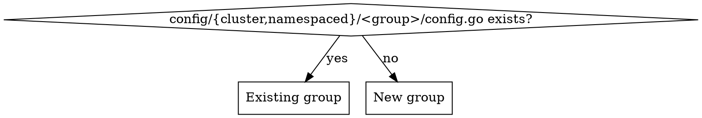

# Add a Nebius Resource

## Overview

provider-upjet-nebius is an Upjet provider wrapping the **Terraform plugin-framework** provider `nebius/nebius`. Adding a resource is config-only: declare it, run codegen, curate examples. Every resource is generated **twice** — cluster-scoped (`<group>.nebius.upbound.io`) and namespaced (`<group>.nebius.m.upbound.io`).

**Core principle:** the resource's behavior is decided by three answers you must look up, never guess — its **NID type prefix** (from the Nebius Go SDK), what its **`parent_id`** represents (from provider-metadata.yaml), and which fields are **references to other in-provider resources**.

## When to use
- Adding one or more `nebius_*` Terraform resources to provider-upjet-nebius.
- Extending an existing group (e.g. another `vpcv1` resource) or introducing a new group.

## When NOT to use
- Reviewing/auditing a provider → use `reviewing-upjet-providers`.
- Changing auth/ProviderConfig, controllers by hand, or non-Nebius providers.

## Architecture pointers
Repo `CLAUDE.md` has the full map. The files you touch:
- `config/external_name.go` — `ExternalNameConfigs` map. **Also gates generation**: a resource absent here is never generated (it feeds `WithTerraformPluginFrameworkIncludeList`).
- `config/groups.go` — `GroupMap`: TF name → (group, Kind).
- `config/{cluster,namespaced}/<group>/config.go` — per-group `AddResourceConfigurator`; references live here. **Keep the two copies identical.**
- `config/{cluster,namespaced}/provider.go` — registers each group's `Configure`.

## Workflow

Track each step as a todo.

**1. Read the schema + metadata for the resource.** It tells you everything below.
```bash
python3 - <<'PY'
import json; r=json.load(open('config/schema.json'))['provider_schemas']['registry.terraform.io/nebius/nebius']['resource_schemas']['<TF_NAME>']['block']
print(json.dumps(r, indent=1)[:4000])
PY
grep -n "<TF_NAME>:" -A40 config/provider-metadata.yaml   # examples + 'metadata.parent_id:' semantics
```

**2. `config/external_name.go`** — add:
```go
"<TF_NAME>": config.FrameworkResourceWithComputedIdentifier("id", "<TYPE>-e0t000000000000000"),
```
`<TYPE>` is the **NID type prefix**, found in the Go SDK proto descriptors — do not invent it:
```bash
grep -rhoE "<servicename>[a-z]+" $(go env GOMODCACHE)/github.com/nebius/gosdk@*/ | sort | uniq -c | sort -rn | head
# confirm the exact token sits on the id field:  grep -rn '<candidate>R\x02id' <gosdk>
```
e.g. `vpcnetwork`, `vpcsecurityrule`, `storagebucket`, `computeinstance`. `e0t` is the default SDK routing code and the 15 zeros are a dummy weakID — copy that part verbatim; only `<TYPE>` changes per resource. (Placeholder is used only for the initial framework read; it must be a syntactically valid NID.)

**3. `config/groups.go`** — add `"<TF_NAME>": ReplaceGroupWords("<group>", <n>)`. The group is service+version concatenated and `<n>` is the number of leading words to drop to reach the Kind: `nebius_vpc_v1_route_table` → `ReplaceGroupWords("vpcv1", 2)` → group `vpcv1`, Kind `RouteTable`. `<n>` = words in `<service>_<version>` (usually 2).

**4. References (only if the resource references other *in-provider* resources).** See decision below. Add to **both** `config/cluster/<group>/config.go` and `config/namespaced/<group>/config.go`:
```go
p.AddResourceConfigurator("<TF_NAME>", func(r *config.Resource) {
    r.References["<dotted_snake_case_tf_path>"] = config.Reference{
        TerraformName: "<target_TF_name>",
        Extractor:     `github.com/crossplane/upjet/v2/pkg/resource.ExtractParamPath("id",true)`,
    }
})
```
- Reference keys are **dotted snake_case TF attribute paths**. Nested single objects work: `ipv4_private.subnet_id`, `next_hop.allocation.id`. **Never use `[*]`** for list elements — Upjet silently drops it.
- A field is a reference only if its target is a resource THIS provider manages. `source_image_id`/`group_id` pointing at a type not in the provider → leave as a plain field, no reference.

**5. `make generate`** (~2–3 min; downloads terraform, pulls docs, regenerates). It rewrites `apis/`, `internal/controller/`, `package/crds/`, `examples-generated/`, and **`config/generated.lst` automatically — never hand-edit `generated.lst`.** Codegen also creates the whole API/controller package for a brand-new group on its own (no manual wiring). If it fails with `No rule to make target 'generate'`, the `build/` git submodule is uninitialized (common in fresh worktrees) — run `git submodule update --init --recursive` and retry; that's an environment issue, not a config error.

**6. `go build ./...`** to confirm. Expect a wide but benign diff (see Gotchas).

**7. Curate `examples/`** from `examples-generated/` — see Examples below.

## New group vs existing group


- **Existing group:** add your `AddResourceConfigurator` block to the existing `config.go` (both scopes). Nothing else.
- **New group, with references:** create `config/cluster/<group>/config.go` and `config/namespaced/<group>/config.go` (each `package <group>`, `func Configure(p *config.Provider)`), AND register them: add `ProviderConfiguration.AddConfig(<group>.Configure)` + the import in **both** `config/cluster/provider.go` and `config/namespaced/provider.go`.
- **No references at all (even for a brand-new group):** steps 2–3 are sufficient — do **not** create any `config.go` or touch `provider.go`. Codegen builds the new group's API/controller packages itself. (An empty `Configure` is clutter — skip it.)

## parent_id — look it up, don't assume

Most Nebius resources have a required `parent_id`. It is **not always the project**. Check the resource's own section in provider-metadata.yaml — scope it, the `metadata.parent_id:` doc lines are easy to misattribute to an adjacent resource (read only between this resource's `<TF_NAME>:` header and the next `nebius_*:` header). Two cases:
- "represents the Project / IAM Container", **or no `metadata.parent_id:` line at all and the example shows a literal `"parent_id": "project-id"`** → leave `parentId` as a literal; examples use `parentId: ${data.nebius_project_id}`. No reference.
- "represents the RouteTable / SecurityGroup / ..." (or the example shows `${nebius_..._x.id}`) → `parent_id` IS a reference; configure it like any other reference in step 4.

## Examples

For each new resource write `examples/{cluster,namespaced}/<group>/v1beta1/<kind>.yaml`, starting from `examples-generated/.../<kind>.yaml` and fixing what codegen can't know:
- Replace `parentId: project-id` → `parentId: ${data.nebius_project_id}` for project-parented resources (uptest injects it via `uptest-data.ini` / `UPTEST_DATASOURCE_PATH`).
- Make each file **self-contained**: append every dependency as extra `---` docs, all sharing `testing.upbound.io/example-name: default`; selectors resolve by Kind, so deps can share one label. (Generated examples point selectors at `example-name: example` with no matching dependency — add the real chain.)
- **namespaced copy** = same content with `apiVersion: <group>.nebius.m.upbound.io/v1beta1` and `namespace: upbound-system` on every doc.
- **No `examples:` block in provider-metadata.yaml → no generated example** (e.g. `nebius_vpc_v1_route`). Hand-build it from the CRD schema in `package/crds/`.
- Validate field names/enums against the generated CRD before finishing.

## Gotchas

| Symptom / question | Reality |
|---|---|
| Resource added to GroupMap but not generated | It must also be in `ExternalNameConfigs` — that map drives the include list. |
| Guessing the NID `<TYPE>` prefix | Grep the gosdk proto descriptors; only the type token is per-resource, `e0t000000000000000` is fixed. |
| `parent_id` assumed = project | Check `metadata.parent_id:`; for route→RouteTable, security_rule→SecurityGroup it's a reference. |
| Reference on a list field via `key[*].id` | `[*]` is silently dropped. Use dotted path; genuine list-element refs need care/testing. |
| Editing `config/generated.lst` by hand | It's regenerated by `make generate`; leave it. |
| Wide diff in already-committed `zz_*_types.go` after generate | Benign: adding resources that also have `metadata`/`status` makes Upjet rename shared types package-wide (`Metadata`→`<Kind>Metadata`, `Status`→`<Kind>Status`). Fine as long as `go build ./...` passes. |
| Edited only `config/cluster/.../config.go` | The namespaced copy must match — references are duplicated in both. |

## Common mistakes
- Forgetting the namespaced example variant, or omitting `namespace: upbound-system`.
- Using SDKv2 external-name helpers — this is a **plugin-framework** provider; use `FrameworkResourceWithComputedIdentifier("id", ...)`.
- Adding references to fields whose target resource isn't in this provider.
- Committing before `go build ./...` passes and examples validate against the CRDs.
